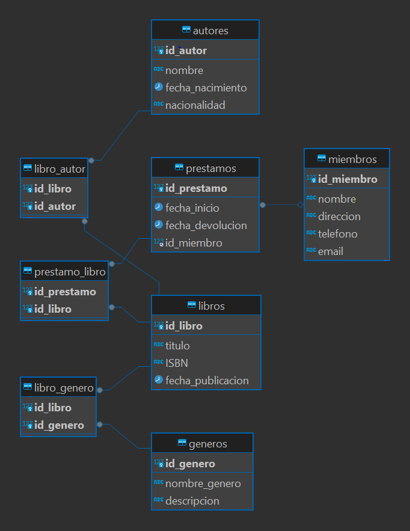

## Entidades y Atributos

### Libro
- **id_libro**: Clave primaria.
- **titulo**: Título del libro.
- **ISBN**: Código ISBN del libro.
- **fecha_publicacion**: Fecha de publicación del libro.

### Autor
- **id_autor**: Clave primaria.
- **nombre**: Nombre del autor.
- **fecha_nacimiento**: Fecha de nacimiento del autor.
- **nacionalidad**: Nacionalidad del autor.

### Género
- **id_genero**: Clave primaria.
- **nombre_genero**: Nombre del género literario.
- **descripcion**: Descripción del género.

### Miembro
- **id_miembro**: Clave primaria.
- **nombre**: Nombre del miembro.
- **direccion**: Dirección del miembro.
- **telefono**: Teléfono del miembro.
- **email**: Correo electrónico del miembro.

### Préstamo
- **id_prestamo**: Clave primaria.
- **fecha_inicio**: Fecha de inicio del préstamo.
- **fecha_devolucion**: Fecha de devolución del préstamo.
- **id_miembro**: Clave foránea que se refiere a la tabla Miembro.

---

## Relaciones

- **Libro-Autor**: Relación muchos a muchos. Un libro puede tener varios autores, y un autor puede escribir varios libros.
- **Libro-Género**: Relación muchos a muchos. Un libro puede pertenecer a varios géneros, y un género puede tener varios libros.
- **Miembro-Préstamo**: Relación uno a muchos. Un miembro puede realizar varios préstamos, pero un préstamo está asociado a un solo miembro.
- **Préstamo-Libro**: Relación muchos a muchos. Un préstamo puede incluir varios libros, y un libro puede estar en varios préstamos a lo largo del tiempo.

---

